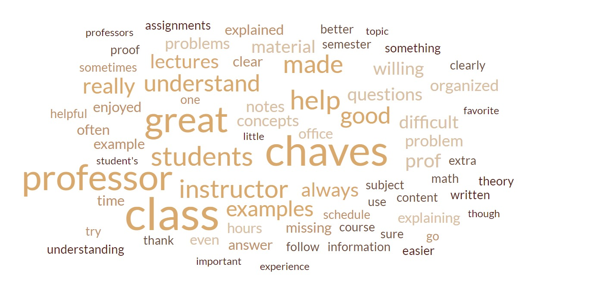
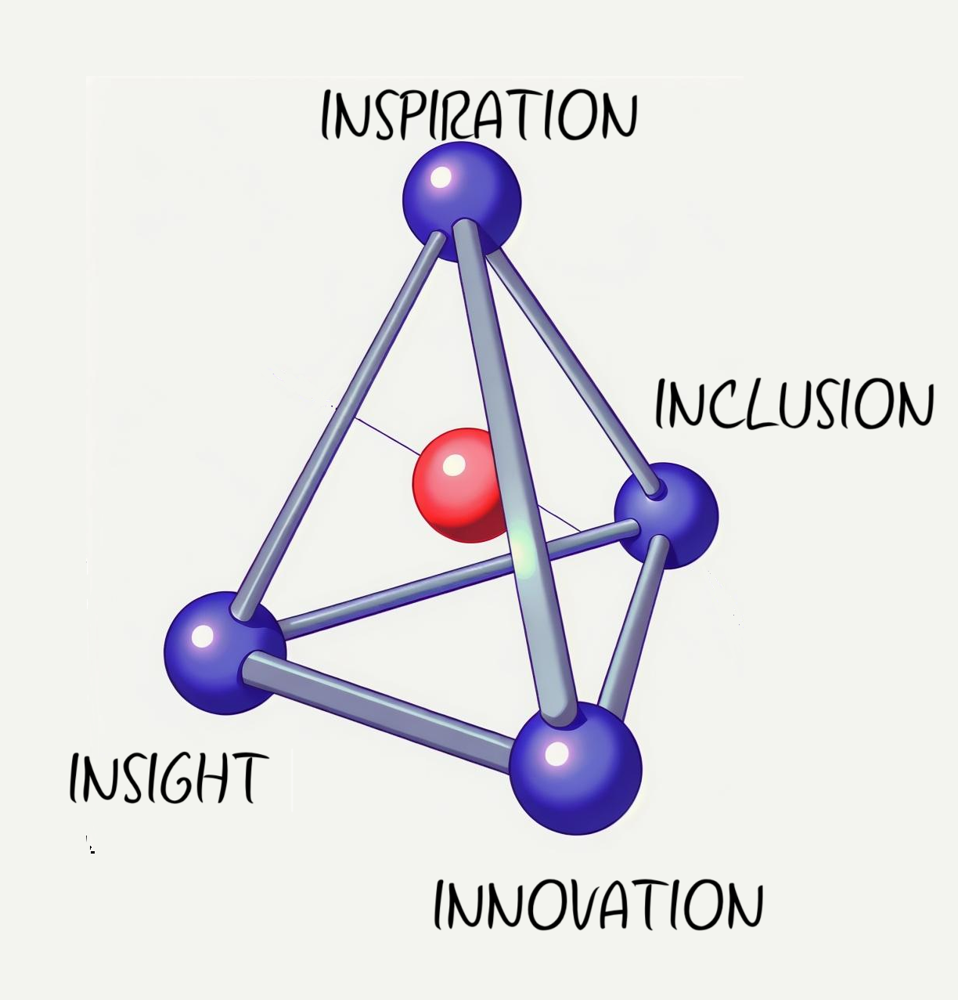



<html lang="en">
<head>
    <meta charset="UTF-8">
    <meta name="viewport" content="width=device-width, initial-scale=1.0">
    
</head>

<a href="#" class="scrollUpButton">▲</a>

  <figure style="flex: 1; text-align: center; margin-right: 10px;">
    
    <figcaption>Word Cloud from Teaching Evaluations</figcaption>
  </figure>

  <figure style="flex: 1; text-align: center; margin-left: 10px;">
    
    <figcaption>Teaching Volumes of Solids of Revolution, University of Rochester</figcaption>
  </figure>
  

I am currently (**Fall 2024**) teaching  [MATH 1920 / Engineering Multivariable Calculus](https://classes.cornell.edu/browse/roster/FA24/class/MATH/1920)  
<h2  class="toggle-btn" onclick="toggleContent('PastClasses')" >  Courses taught at the Univeristy of Rochester (2021-2024) </h2>

<ul class="hidden-content" id="PastClasses">

<li> Summer 2024: Linear Algebra With Differential Equations </li>
<li> Spring 2024: Calculus II and Transition to higher Math </li>
<li> Fall 2023: Precalculus and Linear Algebra w/ written module. </li>
<li> Summer 2023: Discrete Mathematics (Online). </li>
<li> Spring 2023: Discrete Mathematics and Abstract Algebra. </li>
<li> Fall 2022: Discrete Mathematics and Linear Algebra w/ differential equations. </li>
<li> Summer 2022: Calculus I (Online). </li>
<li> Spring 2022: Engineering Calculus II  and Point-set Topology. </li>
<li> Fall 2021: Calculus II and Linear Algebra w/ written module. </li>

</ul> 

<h2  class="toggle-btn" onclick="toggleContent('TeachExp')" >   Relevant Teaching Experience  </h2>

<ul class="hidden-content" id="TeachExp">

<li> In the Summer 2024 I earned a Student Course Development Project Award at UR to develop material for Linear Algebra and Differential Equation courses </li>
<li> During Fall 2023 and Spring 2024, I served as an AP Calculus Visiting Fellow at the US College Board </li>
<li> I was a Teaching Fellow supporting the implementation of WebWork at Western, and authoring problems for Logic, Set Theory and Combinatorics. </li>
<li> I was a supporting instructor for Methods of Calculus at Western University in Winter 2021 creating lecture videos for online teaching during the COVID-19 pandemic. </li>
<li> During 2015-2020 I was a Teaching Assistant at Western University </li>
<li> I was an adjunct lecturer at several universities in Bogota (Colombia) during 2013-2015 </li>

</ul>

<h2  class="toggle-btn" onclick="toggleContent('TeachTools')" >   Great tools to use in the classroom  </h2>

<ul class="hidden-content" id="TeachTools">

<li> WebWork </li>
<li> Geogebra </li>
<li> Desmos </li>
<li> Calc3DPlot </li>
<li> PollEverywhere </li>
<li> Perusall </li>
<li> PreText </li>
<li> Gradescope </li>

</ul>

<h2  class="toggle-btn" onclick="toggleContent('WW')" >  Open source WeBWork Contributions</h2>

<ul class="hidden-content" id="WW">
  <li>Problems in Calculus, Linear Algebra, Logic, Set Theory and Combinatorics.</li>
  <li><a href="/resources/WWfilegenerator.md">WeBWork problem file generator</a> - A tool to create and download WeBWork problems breaking down the main contents of a WeBWork file.</li>
  <li><a href="/resources/downloader.py">WeBWork def problems downloader</a> - A python script to download a set of problems from a .def file (generated by a WeBWork homework set).</li>
  <li><a href="/webwork.pdf">WeBWork Problem Creation Tutorial</a> - A tutorial with companion template files to create the most common WeBWork problems.</li>
</ul>

<h2  class="toggle-btn" onclick="toggleContent('TeachPh')" >   Teaching Philosophy </h2>

My teaching philosophy is student-centered and built on four core principles: Insight, Inspiration, Inclusion, and Innovation. I refer to this as the <em>TetraIdron Philosophy.</em>

            <h3>Insight</h3>
            <ul>
                <li>Reflective Teaching</li>
                <li>Incorporate real-world examples</li>
                <li>Cultivate curiosity</li>
                <li>Visualization and interactive activities</li>
            </ul>
        

        

            <h3>Inspiration</h3>
            <ul>
                <li>Constructivist approach</li>
                <li>Inquiry and problem based learning techniques</li>
                <li>Positive feedback and encouragement</li>
                <li>Foster a Growth mindset</li>
            </ul>
        

        

            <h3>Inclusion</h3>
            <ul>
                <li>Establish a support system</li>
                <li>Recognize barriers and challenges</li>
                <li>Implement Assistive Technology</li>
                <li>Tailored teaching experiences</li>
                <li>Equitable access to opportunities</li>
            </ul>
        

        

            <h3>Innovation</h3>
            <ul>
                <li>Differentiated Teaching</li>
                <li>Technology Integration</li>
                <li>Diverse teaching practices and assessment methods</li>
                <li>Reflective and Classroom Engagement</li>
            </ul>
        

        

            
        

